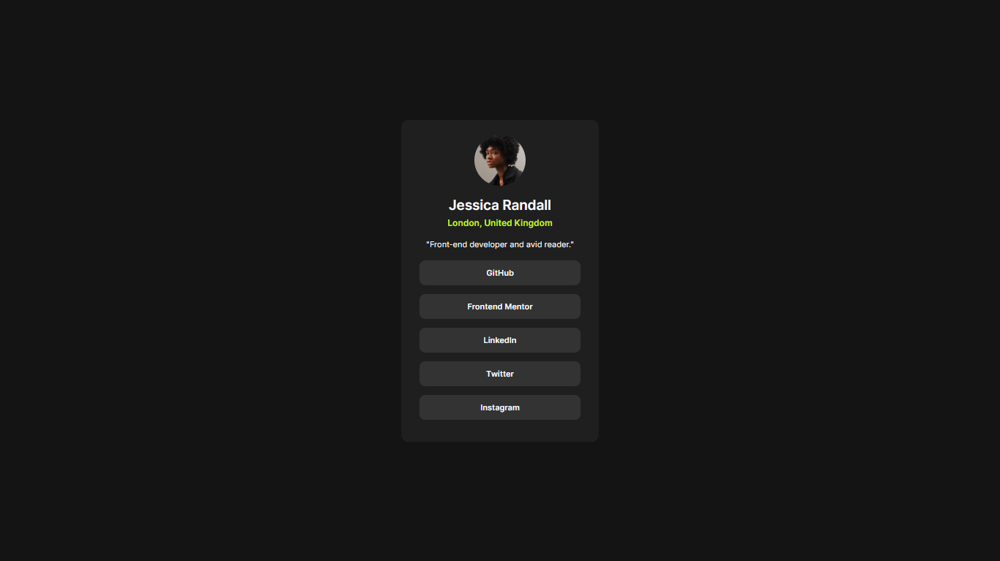

# Frontend Mentor - Social links profile solution

This is a solution to the [Social links profile challenge on Frontend Mentor](https://www.frontendmentor.io/challenges/social-links-profile-UG32l9m6dQ). Frontend Mentor challenges help you improve your coding skills by building realistic projects.

## Table of contents

- [Overview](#overview)
  - [The challenge](#the-challenge)
  - [Screenshot](#screenshot)
  - [Links](#links)

## Overview

### The challenge

Users should be able to:

- See hover and focus states for all interactive elements on the page

### Screenshot

- Desktop

### Links

- Solution URL: [solution](https://github.com/HarshalHK77/social-links-profile)
- Live Site URL: [live site](https://harshalhk77.github.io/social-links-profile/)

### Built with

- Semantic HTML5 markup
- CSS custom properties
- Flexbox

## Author

- LinkedIn - [Harshal Kumbhar](https://www.linkedin.com/in/harshalkumbhar/)
- Frontend Mentor - [@HarshalHK77](https://www.frontendmentor.io/profile/HarshalHK77)
